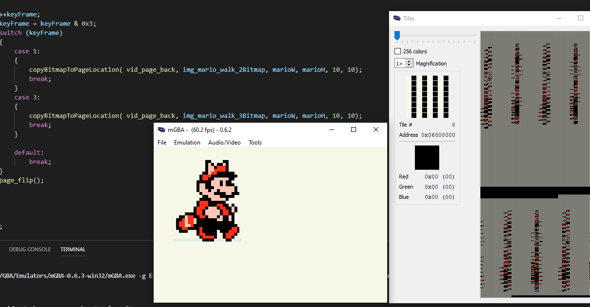

To get this project to build and run from the root directory, the following files in the **.vscode** directory will need to be modified. On the following lines:

**.c_cpp_properties.json**\
**Line 3 should read**: "proj_name":"000_Hello_Pixel"\

**launch.json**  
Line 7 : *"proj_name":"000_Hello_Pixel"* \
Line 20: *"program": "${workspaceFolder}/000_Hello_Pixel/000_Hello_Pixel.elf",*\

**tasks.json**
Lines 05 - 10 :\
```JSON
"options": {
        "env": {
          "proj_working_dir": "PWD=000_Hello_Pixel",
          "proj_name":"000_Hello_Pixel"
        }
     },
```

 **Only need to modify if you are using PC** \
Line 71: *"command": "**path_to_mGBA**/mGBA.exe -g ${workspaceFolder}/$env:proj_name/$env:proj_name.gba;sleep 5;echo debuggerReady"* \
Line 90: *"command": "**path_to_mGBA**/mGBA-0.6.3-win32/mGBA.exe ${cwd}/$env:proj_name/$env:proj_name.gba"* \
**Only need to modify if you are using OS X** \
Line 74 & 93: *"command": "**path_to_mGBA**/mGBA.app/Contents/MacOS/mGBA",* \

